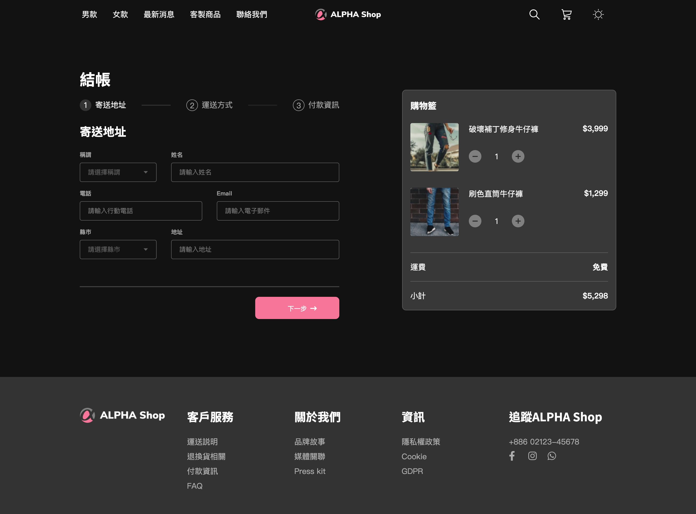

# alpha_shop_vue_scss



## 優化
- 使用者在結帳區塊輸入的資料應被保存。在使用者點擊「確認下單」後，結帳結果會顯示在畫面上。
- 使用 localStorage 把使用者填過的資料存下來，當頁面重新整理後，填過的資料也不會不見。
- router每按下「下一步」時網址會變，若重新整理還是會留在同一個步驟。


## Project setup
```
npm install
```

### Compiles and hot-reloads for development
```
npm run serve
```

### Compiles and minifies for production
```
npm run build
```

### Lints and fixes files
```
npm run lint
```

### Customize configuration
See [Configuration Reference](https://cli.vuejs.org/config/).
